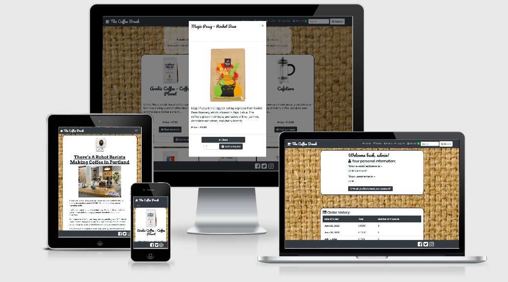
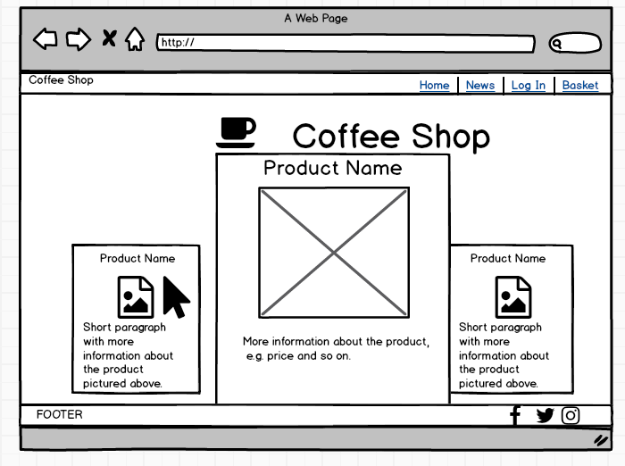

# Dominic Beesley’s 4th Milestone Project

This project is my fourth milestone project for Code Institute, and it’s the Full Stack Frameworks with Django Milestone Project. The aim of the project, according to the project guidelines, was to build a full-stack site based around business logic used to control a centrally-owned dataset. The project also contains an authentication mechanism, and allows users paid access to the site's data and or other activities based on the dataset, such as the purchase of a product service.

In order to fulfil these aims, I’ve created a website that I’ve called ‘The Coffee Break.’ The website allows users to register and purchase bags of coffee or coffee accessories from around the world, as well as read about coffee-related news stories from around the world.

The project has been deployed using Heroku, and can be viewed at [http://domscoffeeshop.herokuapp.com/]( http://domscoffeeshop.herokuapp.com/).

## UX 

The aim of this project was to allow users to visit a website and buy products. My website, ‘The Coffee Break,’ is a website that’s been designed for users to visit and buy new coffee-related products, as well as find out about what’s happening in the coffee world by reading news stories on the news page.

The website’s design was based around coffee, with dark colours in the footer and navbar, and a background image of a sack, reminiscent of a sack that coffee beans would typically be stored in.

On the home page, users can see the available products and read about them, before adding them to their basket.

On the basket page, they can update the number of items in the basket before checking out.

On the checkout page, they can make a payment.

On the user’s profile page, they can view their details, see their order history, and reset their password.

Before I started making the website, I made some rough wireframes of what I hoped to achieve with the website’s main page as well as the layout of some of the other pages of the site. The two wireframes are included below.

### User Stories
I have identified three types main users who wold potentially be using this site, which are the site owner, registered users, and non-registered (or anonymous) users.

#### For the site owner:
* As the site owner, I want to clearly communicate the goals of the website.
* As the site owner, I want to attract users to the website.
* As the site owner, I want to let users sign up and register to buy products from the website.
* As the site owner, I want to let users log in, if they’ve previously registered to the website.
* As the site owner, I want to let users know about the different coffee-related products that are available on the site.
* As the site owner, I want to let users see how many items are in their basket by looking at the navbar.
* As the site owner, I want to let users search for a particular product using the navbar.
* As the site owner, I want to let users add items to their basket.
* As the site owner, I want to let users update the amount of each items in their basket.
* As the site owner, I want to let users remove an item from their basket.
* As the site owner, I want to let users buy products.
* As the site owner, I want to let users view their profile page.
* As the site owner, I want to let users visit my profile page and see all of their information, such as usernames and email addresses.
* As the site owner, I want to let users reset their password by clicking on the button on the profile page.
* As the site owner, I want to let users see their order history, with information such as the date that the order was placed, the amount of items in the order, and the amount that they paid.
* As the site owner, I want to let users log out from the website when they’re done and want to leave.

#### For registered users:
* As a user, I want to be able to visit the site.
* As a user, I want to be able to sign up if it’s my first time visiting.
* As a user, I want to be able to log in after I’ve signed up.
* As a user, I want to be able to reset my password.
* As a user, I want to be able to receive an email with instructions on how to go about resetting my password.
* As a user, I want to be able to view the different products available.
* As a user, I want to be able to search for a particular product using the navbar.
* As a user, I want to be able to see more information about the products by clicking on the ‘Find out more’ button.
* As a user, I want to be able to add a selection of items to my basket.
* As a user, I want to be able to see how many items are in my basket by looking at the navbar.
* As a user, I want to be able to view my basket and update the number of items in there.
* As a user, I want to be able to remove an item from my basket after I’ve already added it to my basket.
* As a user, I want to be able to see the price of all the items in my basket
* As a user, I want to be able to visit the checkout page.
* As a user, I want to be able to enter my details and pay.
* As a user, I want to be able to receive a message telling me my payment was successful.
* As a user, I want to be able to visit my profile page and see my information, such as username and email address.
* As a user, I want to be able to reset my password from the profile page.
* As a user, I want to be able to see my order history, with information such as the date that the order was placed, the number of items in the order, and the total amount that I paid.
* As a user, I want to be able to log out afterwards by clicking on the log out button.
* As a user, I want to be able to visit the news page and read the latest news stories that are there.

#### For non-registered users:
* As a non-registered user, I want to be able to visit the site.
* As a non-registered user, I want to be able to view the different products available.
* As a non-registered user, I want to be able to search for a particular product using the navbar.
* As a non-registered user, I want to be able to see more information about the products by clicking on the ‘Find out more’ button.
* As a non-registered user, I want to be able to visit the news page and read the latest news stories that are there.
* As a non-registered user, I want to have the option to sign up so I can buy products from the site.
* As a non-registered user, I want to be able to log in after I’ve signed up.
* As a non-registered user, I want to be able to reset my password if I’ve forgotten it.
* As a non-registered user, I want to be able to receive an email with instructions on how to go about resetting my password.
* As a non-registered user, I want to have the option to log out afterwards.

## Features 

### Existing Features
* Navbar – The navbar, from [Bootstrap](https://getbootstrap.com/docs/4.0/components/navbar/), is fixed to the top of the screen to allow the user easy access to it at all times. It has links to the home page, the basket, the news page, and the search bar at all times. If the user is logged in, they’ll also see links to their profile page and a log out button. If they’re not logged in, they’ll see buttons to log in or to sign up.
* Bootstrap JavaScript modal – I used the [Bootstrap JavaScript Modal](https://getbootstrap.com/docs/4.0/components/modal/) to create the modal that displays more information about each product to the user.
* Stripe – Used to process the user’s payments when they check out and make an order. There are several steps a user must use to make a test payment using Stripe, and to test this website.
1. For the credit card number, enter 4242 4242 4242 4242.
2. For the credit card security code, or CVV, enter any three numbers.
3. For the expiration date, enter any month or year, as long as they are in the future.
Once the user has done this, the payment will go through.

### Features To Implement Later
*  If I’d had more time to add more features to the site, I would have added a feature that allowed the user to sort the available products. This would allow them to view a selection of them rather than all available products, sorting them by type, or even sorting the varieties of coffee by which country they’d come from.

## Technologies Used 

### Programming Languages
* [HTML](https://www.w3schools.com/html/default.asp) – for creating the structure and layout of the website.
* [CSS](https://www.w3.org/Style/CSS/) – for styling the website’s content.
* [Javascript](https://www.javascript.com/) – for getting Stripe to work, in order to accept payments from the users.
* [Python](https://www.python.org/) – for running the different apps involved in the functionality of this website, such as checkout, basket, and products.
* [Markdown](https://www.markdownguide.org/) – for styling the contents of this README.md, and ensuring they’re displayed correctly for the reader.

### Websites
* [GitHub](https://github.com/) – to host my repository.
* [Gitpod](https://gitpod.io/) – to write the code for the website.
* [Heroku]( http://heroku.com/) – to build, run, and operate my application.
* [Amazon Web Services](https://aws.amazon.com/) – to host the website’s static files, such as images, CSS files, and JavaScript files, using S3.
* [Am I Responsive?](http://ami.responsivedesign.is/#) - to test responsiveness of the site.
* [W3C Markup Validation service](https://validator.w3.org/) - to check the website’s HTML code.
* [W3C CSS Validation Service](https://jigsaw.w3.org/css-validator/) - to check the website’s CSS code.
* [Pexels](http://www.pexels.com) – used to find an image of a coffee cup.
* I used [Code Institute](https://codeinstitute.net/), [W3Schools](https://www.w3schools.com/), [Stack Overflow](https://stackoverflow.com/), and the Code Institute [Slack](https://slack.com/) to look for help with my code when I couldn’t solve a particular problem on my own.

### Tools
* [Balsamiq](https://balsamiq.com/) – This program was used to create rough wireframes of the website’s homepage, in order for me to be able to visualise it properly before I began to actually build the site.
* [Bootstrap](https://getbootstrap.com/) – I used this framework in order to put together the structure of the website, as well as implement features such as the navbar and the modal.

## Testing 

## Screen Sizes And Devices
* I tested the website on multiple browsers, devices and screen sizes.
* I tested the website on both Google Chrome and Safari.
* I also tested the website on different devices, including my laptop (which is a MacBook Air) and my phone (which is an iPhone 8).
* This testing on different browsers, devices and screen sizes helped me to ensure that the site worked as it was designed to work. I was also able to check that all of the content was displaying correctly for the user, and working correctly – for example, I was checking to see if the site would crash when I clicked a button, or went to a new page of the website. I was also able to see if the website’s content was responsive on different screen sizes, and that different pages loaded as they were meant to.

## Getting Other People To Test it
* I got several friends and members of my family to test the website for me.
* They tested it with actions such as signing up, adding products to the basket, resetting their password and updating it, looking at their profile page, making orders, and seeing if the order history section on their profile page was updated correctly.
to ensure that everything worked as it was meant to. 
* I also got them to check if everything made sense and asked them to let me know if they needed any further explanations from me on how the site was meant to work.
* This helped me to fix errors such as pages linking to the wrong pages, or links that led nowhere.
* I updated the background image, after a user told me they thought it looked too low-res.
* One bug that was pointed out, for example, was that the order history section on the user’s profile page didn’t show the correct amount of products in an order. I was able to correct this and ensure that it showed the correct number of items.
* Using some of their feedback, I was also able to add explanations for the user to the website, where some parts weren’t as intuitive as I’d originally meant them to be for the user.

## Using Online Tools and Websites
* I used [Am I Responsive?](http://ami.responsivedesign.is/#) to check the responsiveness of the website. Using this online tool, I was able to see what the website looked like on several different devices and screen sizes at the same time, and compare them all to each other to check that they looked right. 
* I validated the HTML code using the [W3C Markup Validation service](https://validator.w3.org/), and no errors were found.
* I validated the CSS code using the [W3C CSS Validation Service](https://jigsaw.w3.org/css-validator/), and no errors were found.

## Deployment 

### Introduction
* This website was deployed using Heroku.
* The code for the site was written using Gitpod.

### Creating the app on Heroku
* To deploy it on Heroku, I first signed into Heroku, using the username and password, which I’d chosen when I first registered with Heroku.
* Once signed into Heroku, I went to the Heroku dashboard.
* I clicked on ‘New.’
* I then clicked in ‘Create new app.’ 
* This took me to a page where I named the app. The app had to be unique, and I chose the name ‘domscoffeeshop.’
* I was also able to choose a region – for this, I chose Europe.
* I then clicked on ‘Create app,’ which took me to the app’s dashboard, as it was now created.
* On the dashboard, I clicked on ‘Resources’.
* In the ‘Add-ons’ section, I searched for Heroku Postgres and selected it. 
* I then chose the Hobby Dev – Free option.
* This added a Database URL to the app’s config vars.

### Creating a new database
* On my Gitpod workspace, I installed dj_database_url, psycopg2, and gunicorn.
* In settings.py I updated the databases section with the new Heroku Postgres database information, and added the Database URL to env.py.
* I then did makemigrations and migrate, to add information to the new database.
* I then created a new superuser.

### Deploying the website
* On Heroku, I updated the config vars section with information that was saved in my env.py file.
* Before I pushed the code from Gitpod to the Heroku server, I created two files – requirements.txt (which contained a list of the dependencies my site was using) and a Procfile (which contained the instruction ‘web: gunicorn coffeeshop.wsgi:application’).
* On Heroku, I clicked on the Deploy tab, and then clicked GitHub.
* I searched for the name of my repository and then connected to it.
* I also enabled ‘automatic deploys’ so that the website would automatically update.
* Once that was done, I was then able to push the code to Heroku using the commands ‘git add,’ ‘git commit,’ and then ‘git push.’

## Credits 

### Code
* I used [W3C Markup Validation service](https://validator.w3.org/) to validate the HTML code, and there were no errors found.
* I used [W3C CSS Validation Service](https://jigsaw.w3.org/css-validator/) to validate the CSS code, and there were no errors found.
* I used code from the lessons I’d learnt from [Code Institute](https://codeinstitute.net/), in particular the ecommerce mini-project.
* I also had help from [W3Schools](https://www.w3schools.com/) and [Stack Overflow](https://stackoverflow.com/) when trying to solve problems with my code.
* I also used Code Institute [Slack](https://slack.com/) to look for help when I needed it.

### Content
* Some of the information on the coffee products, as well as images of the products, was from the coffee brand’s own websites, such as the ones listed below.
* [Coffee Planet](https://coffeeplanet.com/ground-coffee-c1/signature-arabic-ground-coffee-p25).
* [Rocket Bean Roastery](https://www.rocketbeanroastery.com/collections/rocketbean-coffee/products/magic-pussy-ethiopia-lot-11-espresso-200g-rocket-bean-roastery).
* [HAYB](https://haybcoffee.pl/produkt/espresso/gwatemala-huehuetenango/).
* [Five Elephant](https://www.fiveelephant.com/collections/coffee/products/guatemala-finca-el-socorro-maracaturra?variant=19099042181).
* [Taylors of Harrogate](https://www.taylorsofharrogate.co.uk/products/lazy-sunday/).
* [Gonzo](https://nightjar.coffee/product/gonzo-seasonal-blend/). 

### Media
* The image of sackcloth material, which I used as the background image on the website, is from [here](https://www.needpix.com/photo/1383377/background-burlap-jute-twine-closeup-rough-natural-cloth-brown).
* The image of a coffee cup, which was used for a profile picture when posting news stories on the news page, is from [Pexels](https://www.pexels.com/photo/happy-coffee-6347/).
* I also used some images for the news story posts on the news page.
* The image of the face mask is from [ShoeX’s official website](https://shoex.net/airx-pack-of-5-white.html).
* The image of the coffee-making robot is from [here](https://dailycoffeenews.com/wp-content/uploads/2020/05/Robot-Barista-arm.jpeg).

### Social Media
The links to social media pages in the footer of the website are all to my own Facebook, Instagram, and Twitter pages. If this was a website for a real functioning company, the links would direct users to The Coffee Break’s own official Facebook, Instagram and Twitter pages.

### Acknowledgements
* I received inspiration and guidance for this project from my mentor, Oluwaseun Owonikoko.

